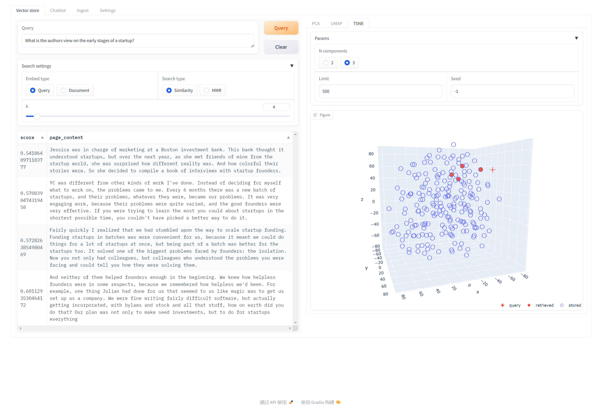
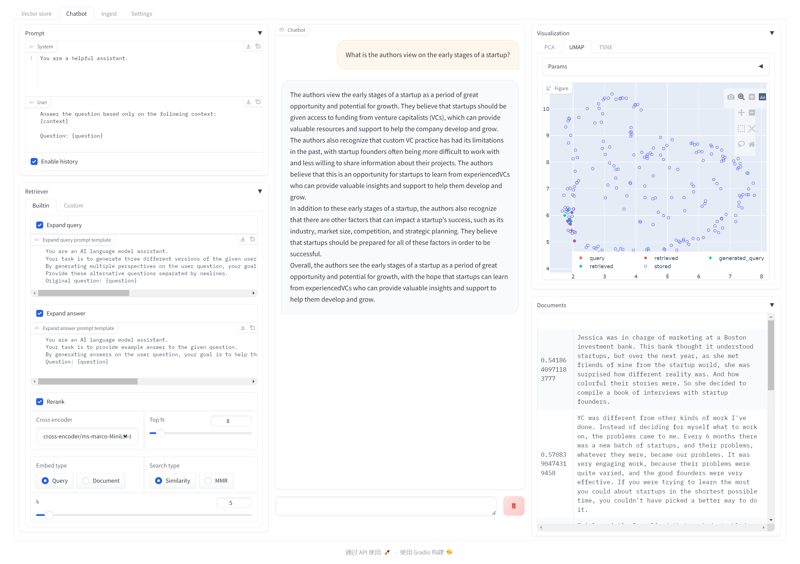

# 🤖🔍 rag-scope

⚒️ Fast building and debugging RAG workflows ⚒️

|                      Vector store                       |                    Chatbot                    |
|:-------------------------------------------------------:|:---------------------------------------------:|
|  |  |

## 📥 Install

Dependencies:

- Python 3.11+
- Pytorch 2.3.0

```bash
git clone git@github.com:nex3z/rag-scope.git && cd rag-scope
pip install -e . 
```

## 🤔 What is rag-scope?

**rag-scope** is a tool for developing RAG workflows.

- Embed query text and search documents in vector store. Visualize documents using embeddings.
- RAG chatbot development. Chat with prompt engineering, pipeline tuning and visualization side by side.
- Extensible modules and workflows by adopting [langchain](https://github.com/langchain-ai/langchain) key abstracts and interfaces.

## 💻 CLI

```bash
rscope launch --help
```

## 🚀 Quick Start

### 1. Prepare an LLM 

For quick experimentation, you can use the Qwen1.5-0.5B-Chat model from the [llamafile collection](https://www.modelscope.cn/models/bingal/llamafile-models/summary).

Download the [Qwen1.5-0.5B-Chat](https://www.modelscope.cn/api/v1/models/bingal/llamafile-models/repo?Revision=master&FilePath=Qwen1.5-0.5B-Chat/qwen1_5-0_5b-chat-q4_k_m.llamafile) to your local machine.

- Linux / macOS:

```bash
chmod +x qwen1_5-0_5b-chat-q4_k_m.llamafile
./qwen1_5-0_5b-chat-q4_k_m.llamafile --port 8000
```

- Windows:

```bash
ren qwen1_5-0_5b-chat-q4_k_m.llamafile qwen1_5-0_5b-chat-q4_k_m.exe
qwen1_5-0_5b-chat-q4_k_m.exe --port 8000
```

This will deploy the model locally and start an OpenAI style API service on port 8000. You’ll see the llama.cpp page in your browser.

### 2. Build sample data and launch

Execute the following command to build a sample database (using text from [paul_graham_essay.txt](data/documents/paul_graham_essay.txt)) and start the web interface with default settings.

```bash
rscope launch-demo --init
```

## ⚙️ Customization
In the Settings page, you can configure the following components:

### Embeddings

HuggingFaceBgeEmbeddings and [BAAI/bge-small-en-v1.5](https://huggingface.co/BAAI/bge-small-en-v1.5) is used by default. 

You can use other community or custom [Embeddings](https://github.com/langchain-ai/langchain/blob/master/libs/core/langchain_core/embeddings/embeddings.py), eg [Embeddings models](https://python.langchain.com/docs/integrations/text_embedding).

### Vector store

[Chroma](https://docs.trychroma.com/) is use by default.

To use other vector stores, implement [EmbeddingExtractor](rag_scope/vector_store/embedding_extractor.py) to use other vector stores. Fill document embeddings in the metadata for visualization to work.

### LLM

A local deployed OpenAI API is used by default.

You can use other community or custom [BaseChatModel](https://github.com/langchain-ai/langchain/blob/master/libs/core/langchain_core/language_models/chat_models.py), eg [Chat models](https://python.langchain.com/docs/integrations/chat/).
